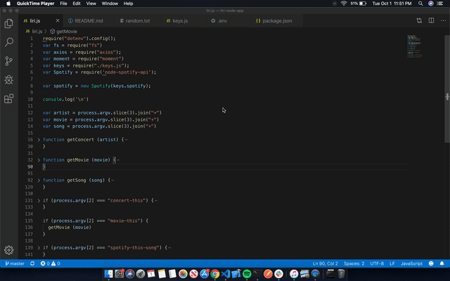

# LIRI Node App

This is a node application that is a language version of siri --- LIRI = "Language Interpretation and Recognition Interface". The application takes in paramaters from the command line and returns data based what calls are made.

The application serves to give you infromation about concerts for a particular artist, about a particular movie, or about a particular song. 

## Organization

The app is organized through the main liri.js javascript files which takes in all node requirements and houses the functions that return the data based on the command line. The app also stores keys and node packages in separate files. 

## How To Use The App

Once downloaded or via the link below, open the terminal for the file and follow along below:
- To get information about concerts for a musician, enter the following on the command line: "node liri.js concert-this *insert artist name here*"
- To get information about a movie, enter the following on the command line: "node liri.js movie-this *insert movie title here*" 
      Note: if no movie is entered, it will give data for the movie "Mr. Nobody"
- To get information about a song, enter the following on the command line: "node liri.js spotify-this-song *insert song name here*"
      Note: It will return the first 5 songs via Spotify 
      Note: if no song is entered, it will give data for the song "The Sign" by Ace of Base
- To read and run the command in the random.txt file, enter the following on the command line: "node liri.js do-what-it-says"
      Note: right now, based on random.txt, it will return Spotify information for the song "I Want it That Way"

## See The App In Action

## Use LIRI

Try it for yourself [here](https://max-magura.github.io).

## Tech Used

Node.js
moment.js
Axios to get OMDB (online movie database) and BandsInTown data
Spotify node 

## Fully created by Max Magura, Fall 2019
